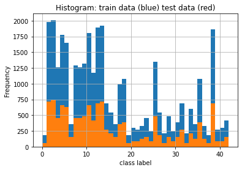
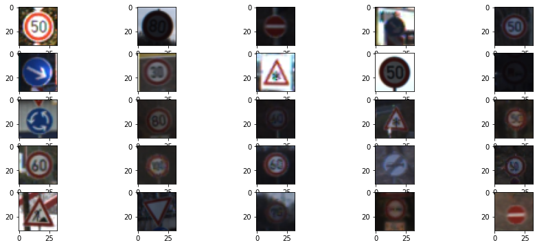

# Traffic Sign Classifier

This project builts a LeNet convolutional neural network using TensorFlow to classify german traffic signs using the [German Traffic Sign Dataset](http://benchmark.ini.rub.de/?section=gtsrb&subsection=dataset).

The steps of this project are the following:
* Load data set
* Data exploration
* Design, train and test a model architecture

### Data Set Summary & Exploration

It uses pandas library to calculate summary statistics of the traffic signs data set:

* The size of training set is 34799
* The size of the validation set is 4410
* The size of test set is 12630
* The shape of a traffic sign image is (32, 32, 3)
* The number of unique classes/labels in the data set is 43

Next figure presents an exploratory visualization of the data set. The number of samples for each class available in the training and test data set are represented in blue and red, respectively.

It can be noted that the dataset is not balanced in terms of the number of samples for each class, which can affect the ability of the model to classify new images.
The fact that both test and training dataset presents a similar inbalance is positive and the model might still produce a satisfactory performance.
Augmenting the dataset to make it a more uniform distribution can be a technique used to improve performance.

A random sample of images present in the data set can be visualized below:

### Model Architecture

The first step to design the framework is preprocessing training data. The preprocessing employed is composed by converting images to gray scale and normalizing them.
Normalization is an important step to improve performance of the neural network. It impacts positively the gradient descent algorithm by improving computation speed and making it more robust.

Finally, the neural network architecture used is a LeNet CNN that is composed of the following layers:

| Layer         		|     Description	        					| 
|:---------------------:|:---------------------------------------------:| 
| Input         		| 32x32x1 grayscale normalized image   			| 
| Convolution       	| 1x1 stride, valid padding, outputs 28x28x6 	|
| RELU					|												|
| Max pooling	      	| 2x2 stride, valid padding, outputs 14x14x6	|
| Convolution       	| 1x1 stride, valid padding, outputs 10x10x16 	|
| RELU					|												|
| Max pooling	      	| 2x2 stride, valid padding, outputs 5x5x16		|
| Fully connected	    | 400 inputs and 120 outputs					|
| RELU					|           									|
| Fully connected	    | 120 inputs and 84 outputs						|
| RELU					|           									|
| Fully connected	    | 84 inputs and 43 outputs						|
| Softmax				| 			   									|

### Model training

The model described above is trained using Adam optimizer, 30 epochs and learning rate of 0.001.
Due to memory constraints, the model uses batches of 128 images for training.
The accuracy achieved for the validation data set is 92%.

### Model testing

After training the model, a test dataset is used to evaluate the ability of the model to generalize the classification to new images.
As mentioned before, the size of test set is 12630 images and it resulted in an accuracy of 91%
 